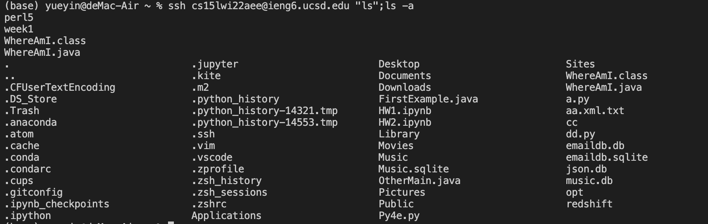

# Lab Report 1 (Week 2)

## - Installing VScode

> - go to the vscode website [vscode](https://code.visualstudio.com/)
> - download the right version and install it on your computer

> - it should be look like this!

---

## - Remotely Connecting

> - open a new terminal
> - enter `ssh cs15lwi22aee@ieng6.ucsd.edu`
> - type the right password

---
## - Trying Some Commands

Here are some commands!
> - cd = change directory
> - ls = shows files
> - mkdir = makes a folder
> - ls -l = shows files with more info
> - pwd = prints working directory
> - cp = copy

---
## - Moving Files with scp

> - create a java file
> - enter command `scp WhereAmI.java cs15lwi22aee@ieng6.ucsd.edu:~/` and Password
> - the file we create on our local computer will save to the server

---
## - Setting an SSH Key

> - to set the keys, we use command `ssh-keygen`
> - save the key in the file: /Users/yueyin/.ssh/id_rsa
> - enter the empty passphrase twice

> - the keys is set up and we can run the command from the client to the server without entering the password

---
## - Optimizing Remote Running

> - enter command `ssh cs15lwi22aee@ieng6.ucsd.edu "ls -la"`(I use 41 keystrokes to run this command, but we could use up head arrow to run the same command next time to save some time)

> - after we setting the ssh key, we can run the command more easily on the remote server from the client

> - this one I use 12 keystrokes by using the up head arrow to run the command

> - I use 69 keystrokes on executing the java file
> = the `;` could help us to type all the command first and run it one by one

---

