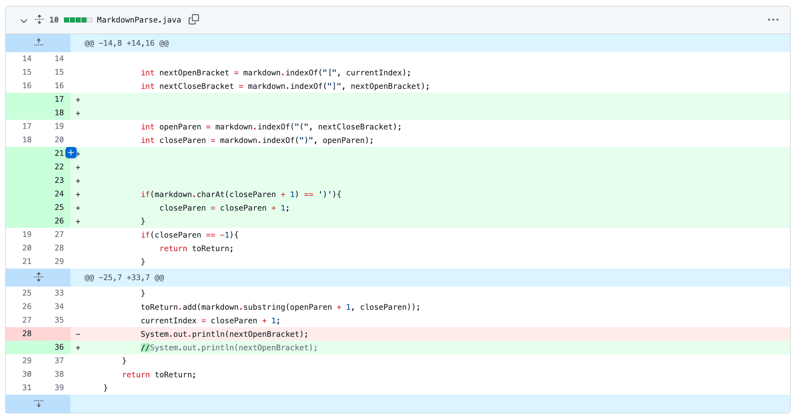
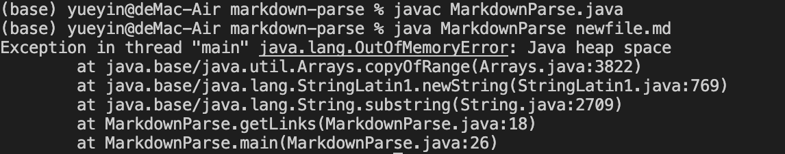
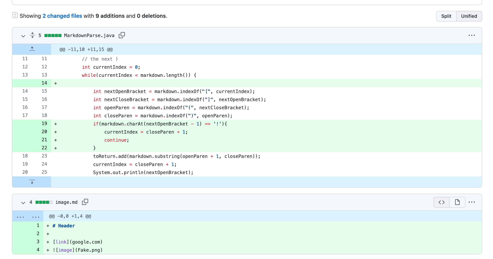
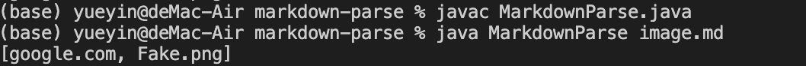
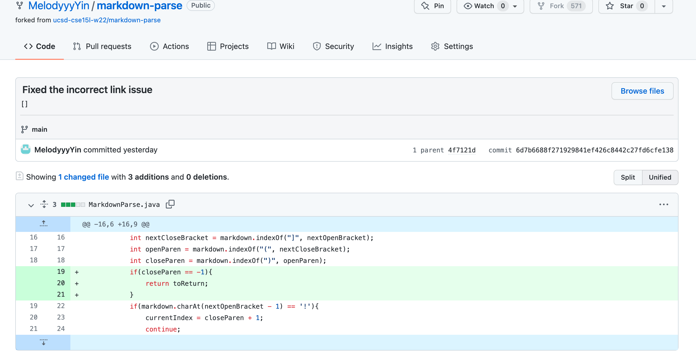
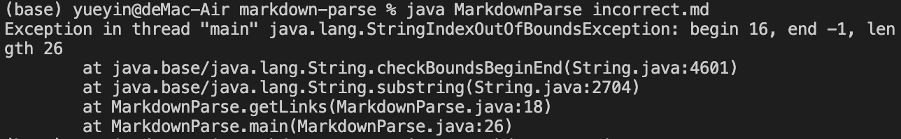

# Lab Report 2 (Week 4)

## - 1st code change (two parentheses in the file)
> - 
This is the [test file](https://melodyyyyin.github.io/markdown-parse/newfile.md) for two parentheses in the file.

> - 
This is the output of running the file at the command line for two parentheses in the file, it shows error of `Exception in thread "main" java.lang.OutOfMemoryError: Java heap space`

> - The reason for this symptom is because the code store the index of first close parenthesis, not the last one. The correct index of close parenthesis is the last close parenthesis. The correct index of open parenthesis. Then, we want to get the things between those parentheses
> - If the close parenthesis's next character is still `)`, we should update the index of close parenthesis

---

## - 2nd code change (image in the file)
> - 
This is the [test file](https://melodyyyyin.github.io/markdown-parse/image.md) for image in the file.

> - 
This is the output of running the file at the command line for image in the file, it shows `[goolge.com, Fake.png]` , which is not our epectation. We want the output without the image.

> - The reason for this symptom is because the code will find the index of two parentheses in the file and get the  things between them. 
> - So we need to write the code to check if the line is for the link or image by checking if the character of first index is `!`.

---

## - 3rd code change (incorrect link in the file)

This is the [test file](https://melodyyyyin.github.io/markdown-parse/incorrect.md) for incorrect link in the file.

> - 
This is the output of running the file at the command line for incorrect link in the file, it shows error of `Exception in thread "main" java.lang.StringIndexOutOfBoundsException: begin 16, end -1, length 26`

> - The reason for this symptom is because we could not find the index of close parenthesis, so we could find the things between two parentheses.
> - To solve this bug, we simply just check if the index of close parenthesis is -1. If it's -1, that means there is no close parenthesis, then we do not add any thing to the toReturn variable.

---