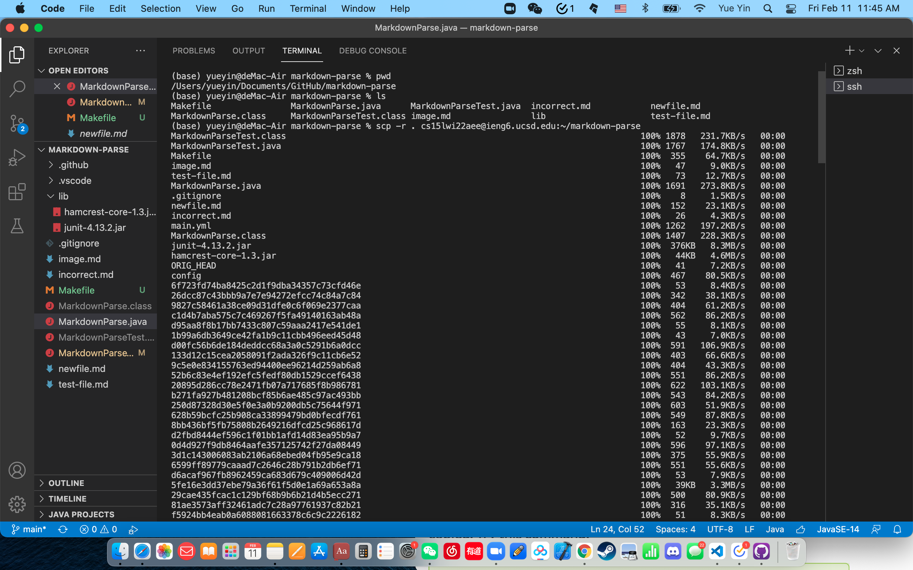
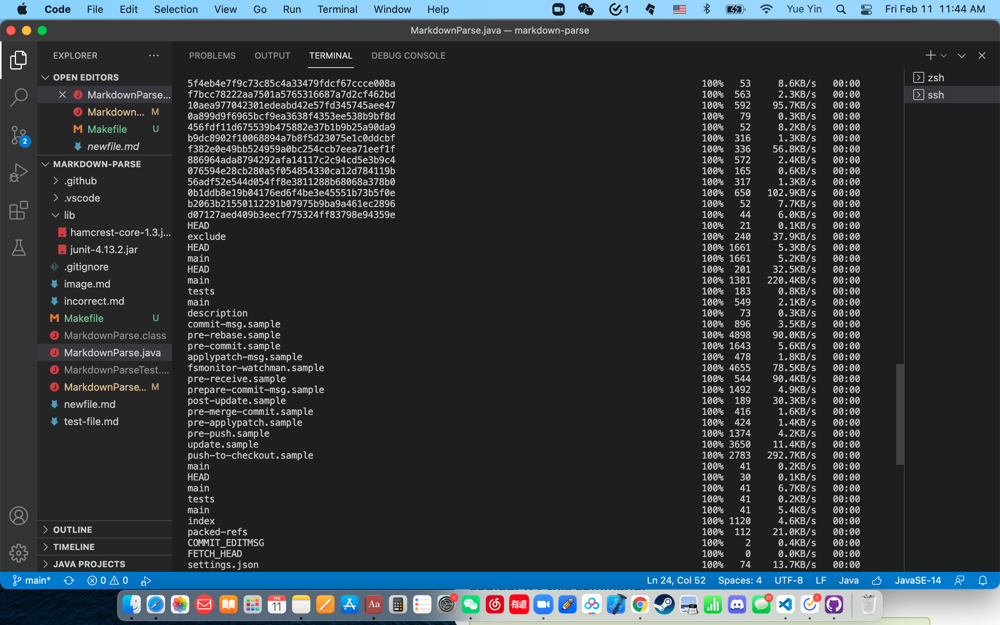
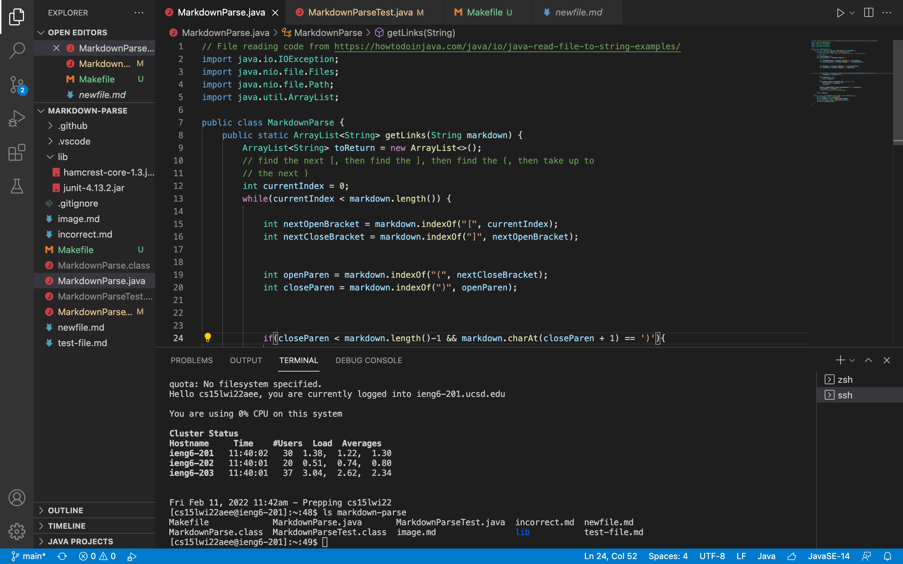
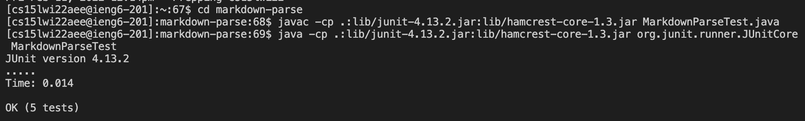
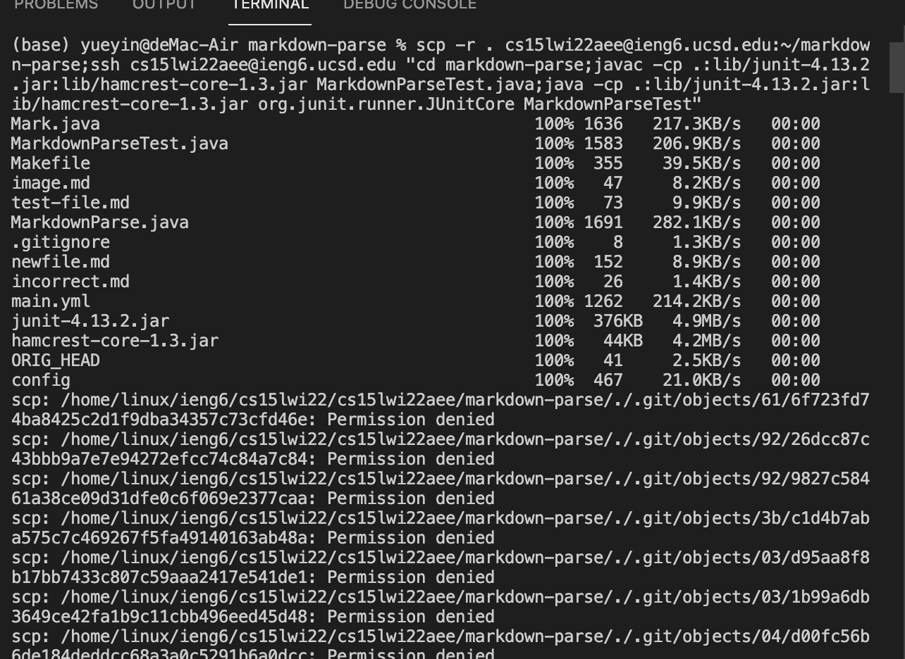
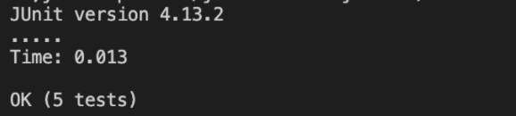

# Lab Report 3 (Week 6)
---
##  [Copy whole directories](https://ucsd-cse15l-w22.github.io/week/week5/#group-choice-3-copy-whole-directories-with-scp--r) with `scp -r`
> 1. Show copying your whole markdown-parse directory to your ieng6 account

- I use command `scp -r . cs15lwi22aee@ieng6.ucsd.edu:~/markdown-parse` to copy my whole markdown-parse directory to my ieng6 account.

> 2. Show logging into your ieng6 account after doing this and compiling and running the tests for your repository

- I log into my ieng6 account use command `ssh cs15lwi22aee@ieng6.ucsd.edu`.

- Then I use `javac` and `java` to compile and run my test.

> 3. Show (like in the last step of the first lab) combining `scp`, `;`, and `ssh` to copy the whole directory and run the tests in one line.

- I use the command `scp -r . cs15lwi22aee@ieng6.ucsd.edu:~/markdown-parse;ssh cs15lwi22aee@ieng6.ucsd.edu "cd markdown-parse;javac -cp .:lib/junit-4.13.2.jar:lib/hamcrest-core-1.3.jar MarkdownParseTest.java;java -cp .:lib/junit-4.13.2.jar:lib/hamcrest-core-1.3.jar org.junit.runner.JUnitCore MarkdownParseTest"` to run all previous command in one line. And it run successfully.

