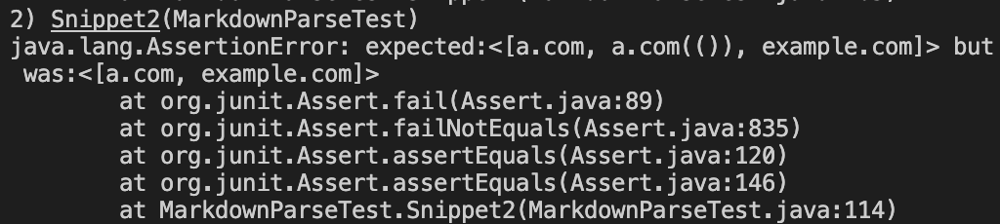
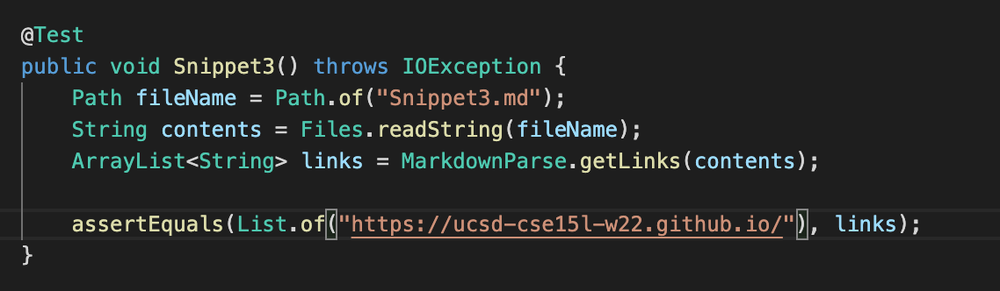
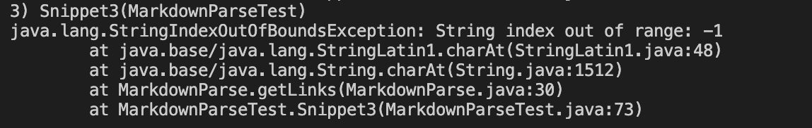
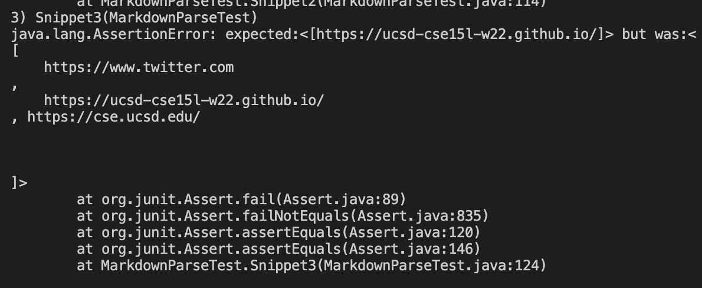

# Lab Report 4 (Week 8)

1. Here is [my markdown repository](https://github.com/MelodyyyYin/markdown-parse) and [the one I reviewed](https://github.com/ericwpei/markdown-parse).
2. 
**Snippet 1**
* the preview should be 
* make it into the test in `MarkdownParseTest.java`

* For my implementation, it fails. This is Junit output.

* For the implementation I reviewed, it also fails. This is Junit output.

* I think there is a small (<10 lines) code change that will make your program work for snippet 1 and all related cases that use inline code with backticks. If we find backticks sign before braket, then we should find the next backticks, then ignore the things between backticks. We also need to double check the things between parenthesis. Make sure to delete the backticks before produce the output. 

**Snippet 2**
* the preview should be 
* make it into the test in `MarkdownParseTest.java`

* For my implementation, it fails. This is Junit output.

* For the implementation I reviewed, it also fails. This is Junit output.

* I don't think there is a small (<10 lines) code change that will make your program work for snippet 2 and all related cases that nest parentheses, brackets, and escaped brackets. Many brakets makes the problem complicated, for the first senario, we need to store the index of last open braket and first close praket, but this can not apply to the last senario. Maybe we could store the index of last open braket and first close praket except there is backslash before the braket.

**Snippet 3**
* the preview should be 
* make it into the test in `MarkdownParseTest.java`

* For my implementation, it fails. This is Junit output.

* For the implementation I reviewed, it also fails. This is Junit output.

* I don't think there is a small (<10 lines) code change that will make your program work for snippet 3 and all related cases that have newlines in brackets and parentheses. Because we cannot determine the link doesn't have a closing parenthesis for a while through index of parentheses. Also, we cannot determine line breaks through index of braket.

