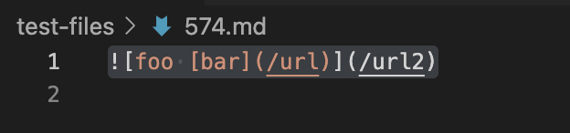
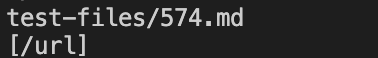
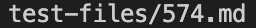
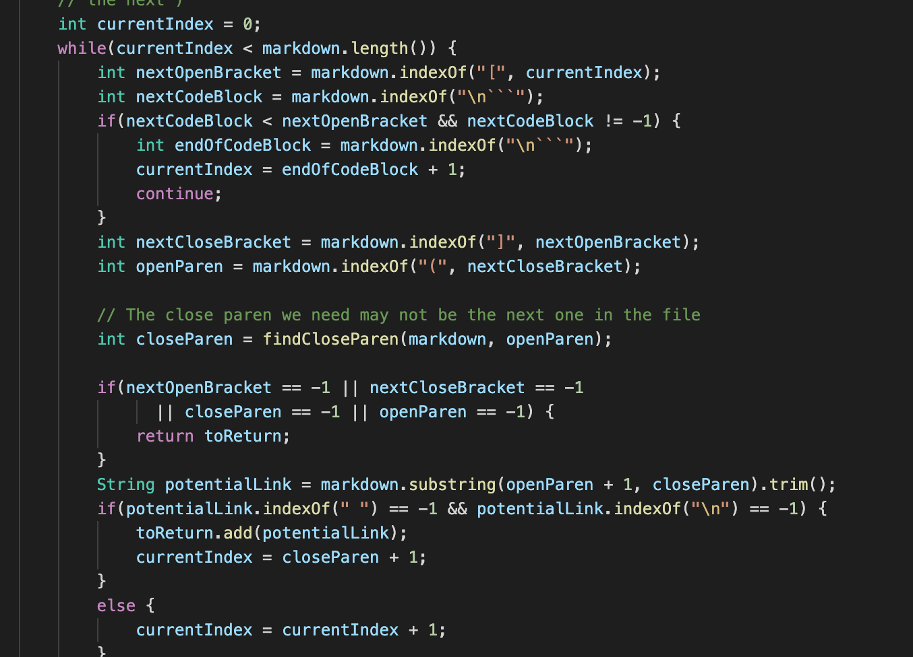
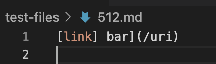
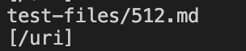
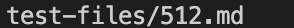
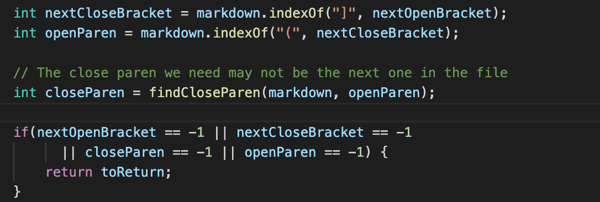

# Lab Report 5 (Week 10)

**Question**
1. How you found the tests with different results?
- I search through manually.

**Test #1**
- I test the `testfile/574.md` on the given implementationa and my own implementation. 

- The output from given implementation:

- The output from my implementation:

- The expect output: `[]`

- If we want to fix this problem in the given impelmentaiton code, we need to chack if there is `!` before `nextOpenBracket`. If yes, that's means this is not a link, it's an image, we set `nextOpenBracket` to -1.

**Test #2**
- I test the `testfile/512.md` on the given implementationa and my own implementation. 

- The output from given implementation:

- The output from my implementation:

- The expect output: `[]`

- If we want to fix this problem in the given impelmentaiton code, we need to add another if statement and create 2 extra variable to store the extra braket and initially set them to `-1`. Between the first bracket and last bracket, if we find extra braket, we store it in a variable and use for loop to find the next close braket between the extra open braket's index to the last close bracket. After forloop done, if the close braket varaible still `-1`, that means we do not have symmerty brakets and we need return immediately. 

